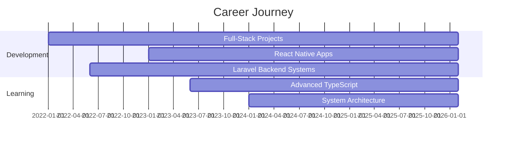

<div align="center">
  
</div>

<div align="center">
  
  
  <p align="center" style="margin-top: 20px;">
    <b style="font-size: 18px;">Crafting high-performance web & mobile applications with modern architecture and clean code principles.</b>
  </p>

  <br>

  <p align="center">
    <a href="https://marwancodes.vercel.app" target="_blank">
      
    </a>
    <a href="mailto:marouaneord@gmail.com">
      
    </a>
    <a href="https://www.linkedin.com/in/marouane-ouarradi/" target="_blank">
      
    </a>
    <a href="https://x.com/marwancodes" target="_blank">
      
    </a>
  </p>
</div>

<br>

---

<br>

<h2 align="center">
  
  About Me
</h2>

<p align="center">
  
</p>

```typescript
const marwan = {
  pronouns: "he" | "him",
  location: "🇬🇧 United Kingdom",
  role: "Full-Stack Developer",
  
  currentFocus: [
    "Building scalable APIs with Node.js & Laravel",
    "Crafting responsive UIs with React & Next.js",
    "Developing cross-platform apps with React Native",
    "Implementing clean architecture patterns"
  ],
  
  techStack: {
    frontend: ["React", "Next.js", "TypeScript", "Tailwind CSS"],
    backend: ["Node.js", "Express", "Laravel", "NestJS"],
    mobile: ["React Native", "Expo"],
    databases: ["MongoDB", "MySQL", "PostgreSQL", "Prisma"],
    tools: ["Git", "Docker", "Postman", "Figma", "Jest"]
  },
  
  learning: ["Advanced React Native", "Serverless Architecture", "DevOps"],
  
  openToCollaborate: true,
  askMeAbout: ["web dev", "mobile dev", "API design", "system architecture"]
};
```

<br clear="right"/>

<br>

---

<br>

<h2 align="center">🚀 What I'm Building</h2>

<table align="center">
  <tr>
    <td align="center" width="50%">
      
      <h3>💼 Professional Projects</h3>
      <p align="left">
        ✅ Full-stack applications with <b>Next.js</b> & <b>Laravel</b><br>
        ✅ Cross-platform mobile apps using <b>React Native</b><br>
        ✅ RESTful APIs with <b>Node.js</b> & <b>Express</b><br>
        ✅ Secure authentication systems (JWT, OAuth)<br>
        ✅ Real-time features with WebSockets<br>
        ✅ Cloud integrations (AWS, Vercel, Neon DB)
      </p>
    </td>
    <td align="center" width="50%">
      
      <h3>🧠 Currently Exploring</h3>
      <p align="left">
        🔹 Advanced <b>React Native</b> patterns (Offline-first, Native Modules)<br>
        🔹 Microservices architecture & Design patterns<br>
        🔹 Serverless functions & Edge computing<br>
        🔹 Test-Driven Development (Jest, Pest, Vitest)<br>
        🔹 Performance optimization & Web Vitals<br>
        🔹 UI/UX best practices & accessibility
      </p>
    </td>
  </tr>
</table>

<br>

---

<br>

<h2 align="center">
  
  Tech Stack
</h2>

<div align="center">

### 🎨 Frontend Development
<p>
  
  
  
  
  
  
  
  
</p>

### ⚙️ Backend Development
<p>
  
  
  
  
  
  
</p>

### 📱 Mobile Development
<p>
  
  
  
  
</p>

### 🗄️ Databases & ORMs
<p>
  
  
  
  
  
</p>

### 🛠️ Tools & Platforms
<p>
  
  
  
  
  
  
  
  
</p>

### 🧪 Testing & Quality
<p>
  
  
  
  
  
</p>

</div>

<br>

---

<br>

<h2 align="center">📊 GitHub Statistics</h2>

<div align="center">
  
  
</div>

<br>

<div align="center">
  
  
</div>

<br>

<div align="center">
  
</div>

<br>

---

<br>


---

<br>

<h2 align="center">💼 Professional Experience</h2>

<div align="center">



</div>

<br>

---

<br>

<h2 align="center">📫 Let's Connect</h2>

<div align="center">
  
  <p>I'm always open to interesting conversations and collaboration opportunities!</p>
  
  <br>
  
  <a href="https://www.linkedin.com/in/marouane-ouarradi/" target="_blank">
    
  </a>
  <a href="mailto:marouaneord@gmail.com">
    
  </a>
  <a href="https://x.com/marwancodes" target="_blank">
    
  </a>
  <a href="https://www.facebook.com/marouane.ouarradi/" target="_blank">
    
  </a>
  <a href="https://instagram.com/marwanwarradi" target="_blank">
    
  </a>
  <a href="https://marwanwarradi.vercel.app/" target="_blank">
    
  </a>

  <br><br>

  <p>
    
  </p>

</div>

<br>

---

<div align="center">
  
### 💡 Fun Fact
  
  *"Code is like humor. When you have to explain it, it's bad!"* – Cory House

  <br>
  
  

</div>

<br>

---
